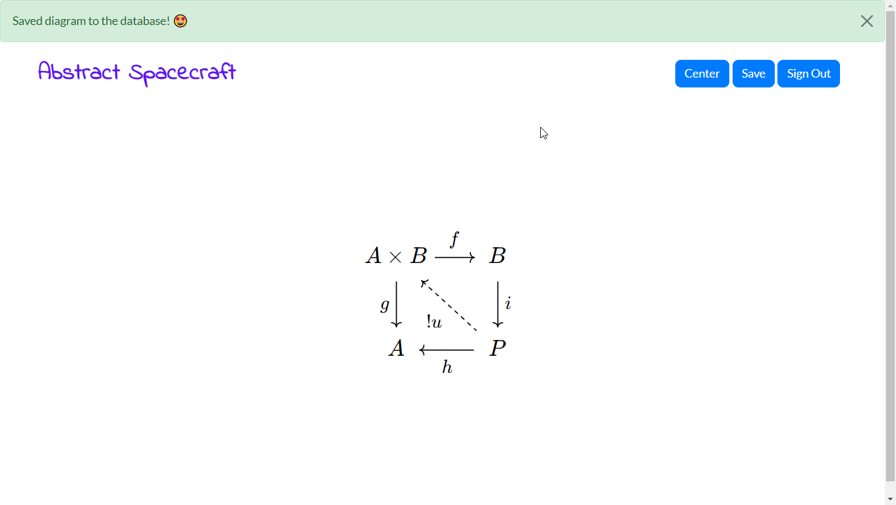

# Database Of Proofs Engine #

Database Of Proofs Engine (DOPE) is a responsive web application for editing commutative diagrams using the well-known __[Quiver CD Editor](http://q.uiver.app)__.

Here is Quiver's repository: [Quiver Source](https://github.com/varkor/quiver).

Additionally, we've outfitted the app with a __[Neo4j Graph Database](https://neo4j.com/)__ for storing these commutative diagrams (CD) and thus eventually for the purpose of constructing human-readable proofs in the areas of __Category Theory, Homological Algebra, Topos Theory__, etc.  That is, usually any abstract math area that is arrow-theoretic.

These definitions & proofs will then be freely accessible to math enthusiasts on the web, via their phone, tablet, or desktop computer.

### Technology stack: ###
* Python 3 Server-side Language & Django Web Framework
* Neo4j Graph Database & [Aura DB as DB host](https://neo4j.com/cloud/aura/)
* Bootstrap Studio & a [BSS to Django export script](https://github.com/enjoysmath/bootstrap-studio-to-django-template)
* HTML, CSS, & Javascript (Quiver is mainly Javascript)

### Current live version of the site: ###
[DOPE Live Site](https://database-of-proofs-engine.heroku.com)

### How do I get set up as a developer? ###

1. If you want to change the GUI (for this project), then you should purchase a $30 license for Bootstrap Studio (or borrow someone's license seat), otherwise you are free to manually edit the HTML & CSS except for your own (forked) project.
2. Have [Python 3](https://www.python.org/downloads/) already installed and on your Path environment variable.
3. Clone this repository to your desktop.
4. Download and install [Wingware Pro](https://wingware.com/downloads/wing-pro) for a Python IDE.  Alternatively, import the project files into your favorite IDE, say PyCharm, and add your project file to this source repo, as well as a note here.
`DatabaseOfProofsEngine.wpr` Wingware project.  Wait for it to load and analyze certain parts.  
6. Do `pip install -r requirements.txt` from a command line, when in the Django root of this project (i.e. where `requirements.txt` is located).
7. With the project open in Wing, click the Run/Debug button.  It should now report no errors in the Debug I/O pane of the Wing IDE, and also say to point your web browser at the address: [http://127.0.0.1:8000](http://127.0.0.1:8000).
8. For front-end GUI editing, you'll need to install a release of the Bootstrap Studio (BSS) to Django (export script)[https://github.com/enjoysmath/bootstrap-studio-to-django-template/releases].  That is, if you're not manually editing the HTML & CSS.  I recommend BSS.  See the [README.md](https://github.com/enjoysmath/bootstrap-studio-to-django-template/blob/master/README.md) of _that_ project for how to call the export script when you click Export in BSS.
9. Now, with everything set up, you should be able to run the Django app once, and continuously edit the GUI in BSS, without restarting the Django app.  You just hit Export in BSS and refresh the webpage if needed.
10. You'll have to consult the Neo4j website if you'd like to run a local Neo4j instance.  Aura DB offers one free database, which is what we currently use on the live site.
11. Ping me in issues if you'd like to develop on this project, and I can email you the Wingware .wpr project file which includes secret credentials and our Neo4j instance info.
12. If you're new to Wingware and developing on your own copy of this project, then you simply right-click the Projects panel in Wingware (Pro) and "Add existing directory", selecting the folder containing your forked project. Then right-click on manage.py and "Set as entry point" with run args `runserver 8000`.  Alternatively, use the Wingware IDE's create-project extension for creating Django projects, create one, and then overwrite the auto-generated files with your forked project's files.

### Current features ###
* Account sign-up & sign-in.  The user needs to be signed-in in order to edit & then _save_ diagrams.
* Diagram editing.
* Some (but not yet all) of the Quiver diagram editor's button actions.
* Diagram saving & loading to & from the Neo4j database.

### Upcoming features ###
* All features of the original Quiver CD Editor.
* Proof creation.  Extremely critical & non-trivial to implement.
* Diagram-to-English output panel.
* Toggle switches for epimorphism, monomorphism, isomorphism.
* Exact rows, columns, diagonals widget and mathematically meaningful tie-in to our Database models.
* Auto-indexing of objects & arrows for faster diagram chasing setup.
* Blogger.com & Math.stackexchange.com outputs for quick post creation.
* Open Auth & Email support supposing the live site grows enough in popularity.

### Videos of current state of the project ###
_(Most recent are listed first)_

1. [Got CD saved to DB](https://youtu.be/lp1dGmL8qQk)

2. (Coming soon!)
